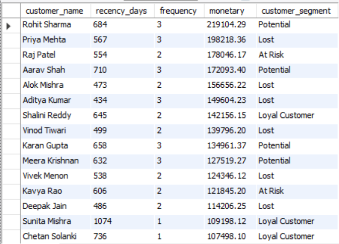
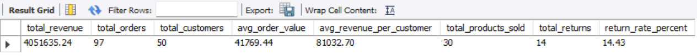

# E-Commerce Analytics Database
### Built with MySQL | 8 Tables | 25 Business Queries

**Live Project:** [View on GitHub](https://github.com/tushitasingh17/ecommerce-sql-analytics)
---

## 📌 Project Overview

Most businesses collect sales data but never extract meaningful insights from it.
This project builds a complete e-commerce analytics system from scratch,
designing the database, populating it with realistic data and writing 25 
business queries that answer real questions a CFO, operations head, or 
marketing team would ask.

---

## 🗄️ Database Structure

8 interconnected tables with 50 customers, 30 products, 100 orders and 200+ order items spanning 3 years of transactions.

| Table | Description |
|---|---|
| customers | 50 customers across 10 Indian states with segment classification |
| products | 30 products across 10 categories from 8 suppliers |
| orders | 100 orders from 2022 to 2025 |
| order_items | 200+ line items with quantity, price and discount |
| categories | 10 product categories across 4 parent groups |
| suppliers | 8 suppliers with performance ratings |
| returns | 14 return transactions with reasons and refund amounts |
| reviews | 30 customer reviews with ratings |

---

## Key Business Insights Found

**Revenue:**
- Total revenue generated: ₹40,51,635
- Average order value: ₹41,769
- Average revenue per customer: ₹81,032

**Customer Intelligence:**
- 50 customers segmented into Champions, Loyal, At Risk, Potential and Lost
- Highest spending customer: Rohit Sharma at ₹2,19,104 — classified as Potential due to recency drop
- Most high-value customers are classified as Lost — signaling a retention problem

**Operations:**
- Return rate: 14.43% — above healthy benchmark of 5-8%
- Premium laptops and smartphones account for majority of returns
- Dead inventory identified across multiple product lines with capital blocked

**Risk:**
- Heavy revenue concentration in Electronics category
- Single supplier dependency identified for high-revenue products

---

## 📊 Query Categories

### Beginner (Queries 1-5)
Basic sales reports, product performance, customer spend, monthly trends

### Intermediate (Queries 6-15)
Geographic analysis, return rates, profitability, dead inventory, 
year over year growth, supplier performance, payment method analysis

### Advanced (Queries 16-25)
Window functions, CTEs, RFM scoring, customer segmentation, 
cohort retention, product affinity, Pareto analysis, churn risk detection

---

## 📸 Screenshots

### Customer Segmentation (RFM Analysis)

### Executive Summary

---

## 🛠️ Tools Used
- MySQL 8.0
- MySQL Workbench

---

## 🚀 How to Run

1. Open MySQL Workbench
2. Run `01_schema_and_data.sql` first — creates database and loads all data
3. Run `02_analysis_queries.sql` — executes all 25 business queries
4. Each query is labeled with the business question it answers

---

## 💡 What I Learned

- Designing normalized relational databases from scratch
- Writing window functions — LAG, NTILE, SUM OVER — for advanced analytics
- Building RFM models used by real e-commerce companies like Swiggy and Flipkart
- Translating business problems into SQL queries
- Identifying actionable insights from raw transaction data
